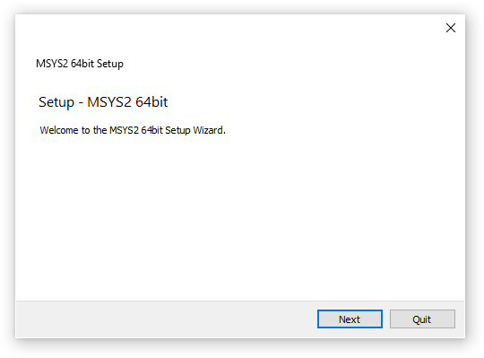

# MSYS2 Installer

## Nightly build

https://github.com/msys2/msys2-installer/releases/tag/nightly-x86_64



## CLI Usage examples

Installing the GUI installer via the CLI to `C:\msys64`:

```powershell
.\msys2-x86_64-latest.exe in --confirm-command --accept-messages --root C:/msys64
```

Uninstalling an existing installation in `C:\msys64` via the CLI:

```powershell
C:\msys64\uninstall.exe pr --confirm-command
```

Installing the self extracting archive to `C:\msys64`:

```powershell
.\msys2-base-x86_64-latest.sfx.exe -y -oC:\
```

## Build Instructions

```bash
# Run in a MSYS2 environment
./make-msys2-installer
```

## New Release TODO List

* Trigger a new nightly build via https://github.com/msys2/msys2-installer/actions/workflows/build.yml or use an existing one
* Get all files with dates in their names, sign them and create checksum files (.sig and .sha256)
* Create a new git tag following format: `date -I`
* Upload the installer files to the release tag
* Update the download link and checksum for the GiHub action and verify that all tests pass: https://github.com/msys2/setup-msys2/blob/master/main.js
* Run `msys2-devtools/update-installer "$(date -I)"` on the server to copy the release from GitHub
* Update the link, name and checksum on the main website (pointing to GitHub): https://github.com/msys2/msys2.github.io/blob/source/web/index.md
